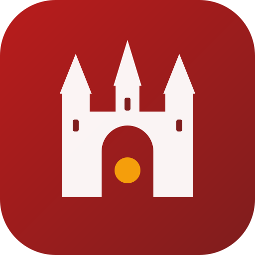

  
  
  # Discover Rothenburg
  
  **Vom Marktplatz bis ins Taubertal – dein smarter Stadtbegleiter.**
  
  
  
  [-0284c7?style=flat-square)](https://github.com/alexschnapper/rothenburg-digital/milestones)

---

### 🏰 Über das Projekt

**Discover Rothenburg** ist ein smarter, barrierefreier und mehrsprachiger digitaler Begleiter für Rothenburg ob der Tauber. Das Ziel ist es, Einheimischen sowie Gästen aus aller Welt einen unkomplizierten, dialogbasierten Zugang zu Kultur, Orientierung, Inklusion und Smart-City-Daten zu ermöglichen.

Das Projekt entsteht zu **100 % quelloffen (Open Source)**, DSGVO-konform und wird auf unabhängigen Servern in Deutschland betrieben.

🔗 **Produktiv-Portal:** [https://rothenburg.digital/](https://rothenburg.digital/)

---

### 🌟 Kernfunktionen & Schwerpunkte

* **♿ Barrierefrei & Inklusiv:** 
  * 1-Klick-Umschalter für **Leichte Sprache** (barrierefreie Formulierung, kurze Sätze).
  * Navigation für stufenfreie Wege auf historischem Altstadt-Pflaster.
  * Reizarme Ruhezonen & sensorische Rückzugsorte im Stadtraum (Neurodivergenz/Sensory-Friendly).
* **🌍 Mehrsprachig von Tag 1:** Direkte Dialogfähigkeit auf Deutsch, Englisch, Niederländisch, Japanisch und weiteren Sprachen ohne Sprachbarrieren.
* **🌿 Smart City & Umwelt:** 
  * Echtzeitdaten lokaler Feinstaub-Sensoren ([Sensor.Community](https://sensor.community/)).
  * Übersicht über E-Ladesäulen (AC/DC) und das Altstadt-Parkleitsystem (P1–P5).
* **🏛️ Kultur & Gastronomie:** Kontextbezogene Antworten für Tagesplanung (z. B. Regenwetter-Tipps mit Kindern, kuratierte Empfehlungen).

---

### 🗺️ Roadmap & Meilensteine

- [ ] **`v0.1-alpha` (Mitte September 2026):** Next.js PWA-Grundgerüst, One-Box-Chat via Vercel AI SDK, Leichte-Sprache-Umschalter und Demo-Staging für den RTS.
- [ ] **`v0.2-beta` (Oktober 2026):** Anbindung von Sensor.Community (Feinstaub PM2.5/PM10), Park- & Ladeinfrastruktur.
- [ ] **`v1.0-release` (Ende 2026 / 2027):** Offline-fähige PWA, Embed-Widget für externe Webseiten und vollständiger Rollout.

---

### 🛠️ Tech-Stack

* **Framework:** Next.js (App Router, PWA)
* **AI / Orchestrierung:** Vercel AI SDK (DSGVO-konforme EU-Modelle / Mistral AI)
* **Design & A11y:** Tailwind CSS, Semantic HTML, Screenreader-optimiert, High-Contrast Support
* **Hosting:** Unabhängiger Linux VPS mit Plesk (Nginx / Node.js Runtime) in Deutschland

---

### 🤝 Mitmachen & Feedback

Wir freuen uns über Mitwirkende, Ideen und Anregungen aus der Bürgerschaft, von lokalen Initiativen und Open-Source-Begeisterten:

* 💡 **Ideen einreichen:** Erstelle gerne ein [GitHub Issue](https://github.com/alexschnapper/rothenburg-digital/issues) mit dem Label `community-proposal`.
* 🐛 **Fehler melden:** Bitte über den [Issue-Tracker](https://github.com/alexschnapper/rothenburg-digital/issues) erfassen.

---

### ⚖️ Disclaimer & Lizenz

Eine unabhängige Open-Source-Initiative, konzipiert und entwickelt von **Alexander Schnapper**.  
*Kein offizielles Angebot der Stadt Rothenburg ob der Tauber oder des Rothenburg Tourismus Service (RTS) – offen für Dialog und Kooperation.*

Der Quellcode ist lizenziert unter der [GNU General Public License v3.0 (GPLv3)](./LICENSE).